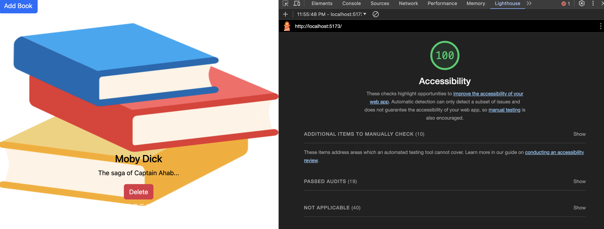

# Can of Books

**Author**:
Evan Cheng  

**Version**: 1.0.0

## Overview

### Purpose

The essence of this project revolves around the profound impact books have on our lives. They serve as a gateway to different worlds, offering insights, knowledge, and experiences that shape our understanding and perspectives. This application is not just an academic assignment; it's a journey into recognizing and documenting the transformative power of books. Our goal is to create a personalized digital space where users can keep track of books that have influenced them profoundly and discover new reads that come highly recommended.

### What This Application Is About  

At its core, this application is a CRUD (Create, Read, Update, Delete) web app that focuses on books as its primary resource. It's designed to manage and track information about books that have made an impact on your life and to recommend what to read next. Whether you're looking to reflect on your reading journey, find your next book, or simply organize your reading list, this app aims to be your go-to digital bookshelf.

### Technical Overview  

The application is built on a modern tech stack, integrating a React front-end with an Express back-end, all while leveraging a MongoDB database for storage. This architecture not only allows for a responsive and intuitive user interface but also ensures robust and scalable data management.

### Key Features

    Data Management: At the heart of the application is the ability to effectively manage book data. This includes creating a schema in the back-end to model the book data precisely as we want it represented.

    Database Seeding: Initial seed data will populate the database with a curated list of impactful books, setting the stage for personalization and discovery.

    Reading Data: The application focuses on the 'Read' operation from CRUD for this assignment, enabling users to view a collection of books retrieved from the database through the front-end interface.

    User Interface: A clean and user-friendly interface to explore books that have made a mark on the users lives or discover new recommendations.

## Getting Started

## Architecture

## Change Log  

04-08-2024 6:45pm - Both repos (backend and frontend) are online.
04-08-2024 7:45pm - Atlas server connected to backend repo.
04-08-2024 8:15pm - Backend repo connected to Render.

## Estimates

    Name of feature: Carousel
    Estimate of time needed to complete: 2 hours
    Start time: 
    Finish time:  
    Actual time needed to complete:  
  

    Name of feature: Add/Delete Modal
    Estimate of time needed to complete: 2 hours
    Start time: 
    Finish time:  
    Actual time needed to complete:  

## Lighthouse Score

### April 9th 2024:

### April 12th 2024:

## Credit and Collaborations

### Collaborations  

#### Logistical

**What hours will you be available to communicate?**  

8am EST - 11pm EST

**What platform will you use to communicate (ie. Slack, phone …)?**  

Slack/Remo

**How often will you take breaks?**  

As needed.

**What is your plan if you start to fall behind?**  

Utilize TA help and schedule tutoring sessions if needed.

#### Cooperative

**Make a list of each person's strengths.**  

- **Ben:** Communication, teamwork, quick-learner
- **Evan:** Communication, teamwork, creativity

**How can you best utilize these strengths in the development of your application?**  

Good communication with each other is important in order to maintain consistent code and debugging of our application.

**In what areas do you each want to develop greater strength?**  

- **Ben:** Technical concepts and understanding of project set-up and initiation. Proficiency with coding procedure.

- **Evan:** Technical concepts and understanding of project set-up and initiation.

**Knowing that every person in your team needs to understand the code, how do you plan to approach the day-to-day development?**  

Require PR review in order to get each person looking at the code and interpreting it.

#### Conflict Resolution

**What will your team do if one person is pulling all the weight while the other person is not contributing?**  

Attempt to communicate the issue, but if no headway is made then inform an reach out to TA’s or faculty to mediate and discussion.

**What will your team do if one person is taking over the project and not letting the other member contribute?**  

Attempt to communicate the issue, but if no headway is made then inform an reach out to TA’s or faculty to mediate and discussion.

**How will you approach each other and the challenge of building an application knowing that it is impossible for two people to be at the exact same place in understanding and skill level?**  

Leave comments and descriptions for specific code. Overall, communicate any questions or concerns so that both parties are aware and if able to, can provide insight or help. Two is one and one is none.
